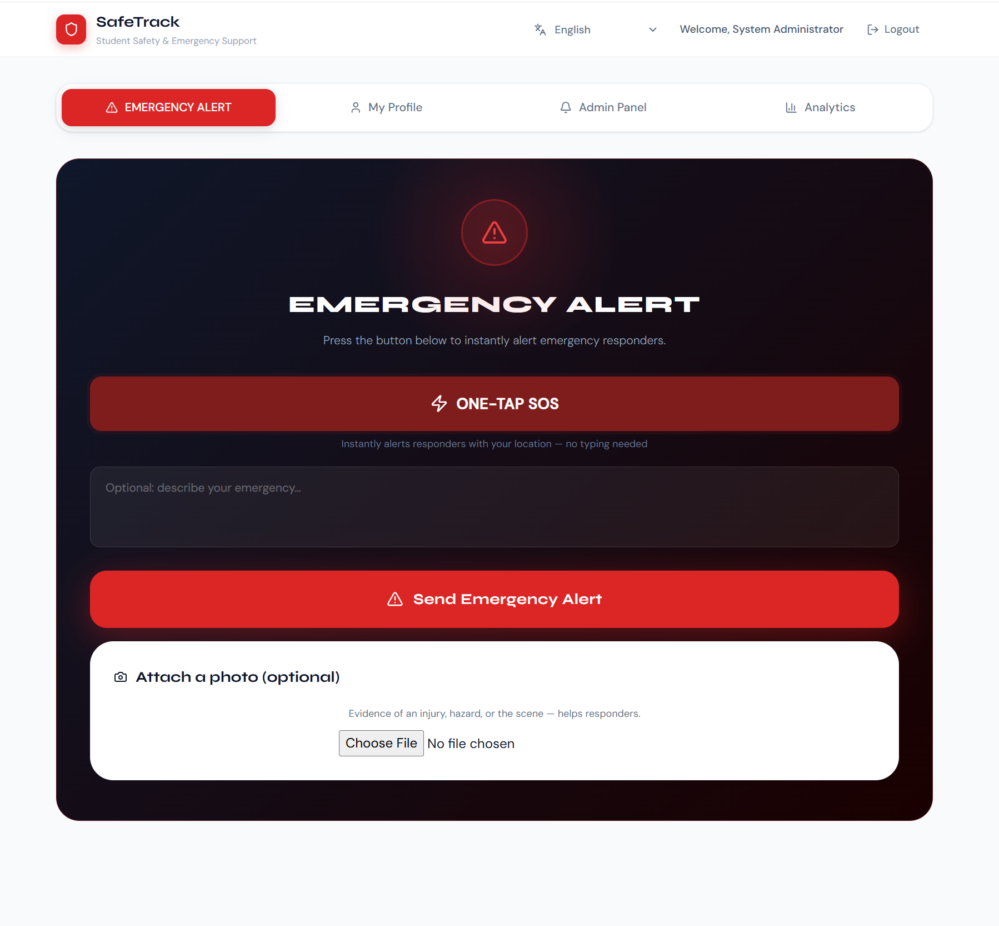
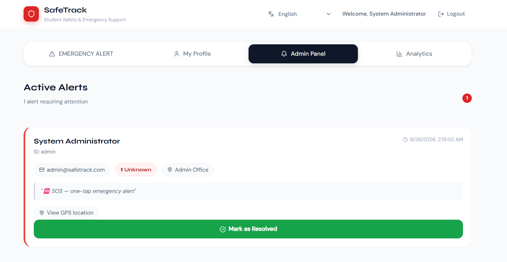
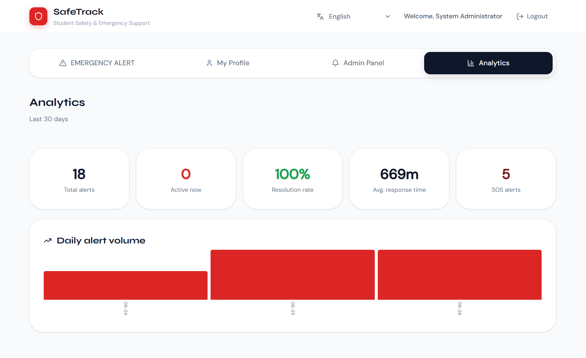

# 🛰️ SafeTrack – Student Safety & Emergency Response Platform
> A real-time, multilingual safety platform built with FastAPI, React, and Azure — for instant emergency reporting, live admin response, and data-driven safety insights.

SafeTrack is a full-featured, privacy-first safety platform built for instant emergency communication. It connects students and administrators through live alerts, secure authentication, real-time push notifications, dynamic multilingual access (100+ languages via Azure Translator), and analytics-backed response tracking — enabling faster, smarter crisis management.

**Live app:** https://safe-track-neon.vercel.app
**API docs:** https://safetrack-backend-6td3.onrender.com/docs

> **Inspiration:** SafeTrack was inspired by the tragic air crash involving students from Milestone School, Bangladesh.
> This incident motivated the development of a technology-driven platform aimed at improving emergency communication, student safety, and crisis response efficiency.

## 📸 Screenshots

| Emergency Alert + SOS | Admin Panel |
|---|---|
|  |  |

**Live analytics dashboard** — resolution rate, response time, and daily alert volume computed from real data:



## 🚀 Overview
SafeTrack provides an interactive safety system designed to protect students during emergencies. It integrates a **FastAPI backend** with **MongoDB Atlas** for secure data operations, a **React frontend** for real-time alert visualization, and multiple **Azure AI services** for translation, storage, and monitoring. Students can report incidents in one tap via the SOS button, attach photo evidence, view their alert history, and administrators can oversee live cases with real-time push updates and a dedicated analytics dashboard — all through one centralized, multilingual interface.

## ✨ Core Features
- 🆘 **Emergency Alerts:** Students can instantly send verified alerts with ID, blood group, contact info, and location
- 🚨 **One-Tap SOS:** A single button auto-captures GPS coordinates and files an alert instantly, with no typing required
- 🌍 **Dynamic Multilingual Support:** Powered by **Azure Translator** — supports 100+ languages, not just a hardcoded pair, with in-memory caching to keep repeat requests instant
- 🔐 **JWT Authentication:** Secure role-based access for students and admins, with bcrypt password hashing
- 🧑‍💻 **Admin Dashboard:** Manage, filter, and resolve active emergencies
- 📡 **Real-Time Push (WebSockets):** Admins see new alerts and status changes the instant they happen — no polling or refresh needed
- 📧 **Email Notifications:** SendGrid-powered alerts to admins on new incidents (with a Google Maps link for GPS-tagged alerts) and to students when their case is resolved
- 🛡️ **Rate Limiting:** Protects the alert and login endpoints from abuse, without ever blocking a genuine emergency
- 📊 **Admin Analytics:** Resolution rate, average response time, daily alert volume, and SOS breakdown — all computed live from real data
- 📈 **Application Monitoring:** Azure Application Insights telemetry tracks alert creation, SOS triggers, and response times in production
- 🖼️ **Photo Evidence Uploads:** Students can attach a photo (injury, hazard, scene) to an emergency alert, stored securely via Azure Blob Storage with time-limited signed URLs
- 🧭 **Real-Time Tracking:** Displays geolocation and timestamps for all alerts
- 💾 **MongoDB Storage:** Fast, flexible, and reliable NoSQL database (MongoDB Atlas)
- 🧩 **Modular APIs:** RESTful, scalable backend routes for users, alerts, and analytics
- 🧠 **Privacy Focus:** Built without third-party trackers or analytics on the client side

## 🧠 Tech Stack
| Layer | Technologies |
|--------|---------------|
| **Frontend** | React, JavaScript (ES6), HTML5, CSS3 |
| **Backend** | FastAPI (Python), Uvicorn, REST APIs, WebSockets |
| **Database** | MongoDB Atlas (Motor async driver) |
| **Authentication** | JWT Tokens, bcrypt password hashing |
| **Cloud AI** | Azure Translator (100+ languages), Azure Application Insights, Azure Blob Storage |
| **Email** | SendGrid |
| **Rate Limiting** | slowapi |
| **Deployment** | Render (Backend), Vercel (Frontend) |
| **Testing** | Python Requests-based integration suite |
| **Version Control** | Git + GitHub |

## 🗂️ Folder Structure
```
SafeTrack/
├── backend/
│   ├── server.py — FastAPI backend: auth, alerts, SOS, analytics, WebSockets
│   ├── notifications.py — SendGrid email notifications (soft-fail design)
│   ├── translation.py — Azure Translator integration with caching
│   ├── monitoring.py — Azure Application Insights telemetry
│   ├── photo_storage.py — Azure Blob Storage photo uploads (soft-fail design)
│   ├── requirements.txt — Backend dependencies
│   └── .env — Environment variables for backend configuration (not committed)
│
├── frontend/
│   ├── public/ — Static files (index.html, favicon)
│   ├── src/
│   │   ├── App.js — Root application logic, routing, auth context
│   │   ├── App.css — Styling
│   │   └── index.js — Entry point for rendering
│   ├── package.json — Frontend dependencies
│   └── .env — Frontend configuration variables (not committed)
│
├── screenshots/ — README screenshots
│
├── tests/
│   ├── backend_test.py — Unit and integration tests for API endpoints
│   ├── test_result.md — Summary of backend test results
│   └── README.md — Testing documentation and examples
│
└── README.md — (This file)
```

## ⚙️ Installation & Setup
### 1️⃣ Clone the Repository
```
git clone https://github.com/ayesha1145/SafeTrack.git
cd SafeTrack
```

### 2️⃣ Backend Setup
```
cd backend
pip install -r requirements.txt
```

Create a `.env` file inside the `backend/` folder:
```
MONGO_URL=your_mongo_connection_string
DB_NAME=safetrack
SECRET_KEY=your_secret_key
CORS_ORIGINS=*

# Optional — app runs fine without these, features soft-fail gracefully
SENDGRID_API_KEY=your_sendgrid_key
NOTIFY_FROM_EMAIL=your_verified_sender_email
ADMIN_NOTIFY_EMAILS=admin1@example.com,admin2@example.com

AZURE_TRANSLATOR_KEY=your_azure_translator_key
AZURE_TRANSLATOR_ENDPOINT=https://api.cognitive.microsofttranslator.com
AZURE_TRANSLATOR_REGION=eastus

APPINSIGHTS_CONNECTION_STRING=your_app_insights_connection_string

AZURE_STORAGE_CONNECTION_STRING=your_azure_storage_connection_string
AZURE_STORAGE_CONTAINER=alert-photos
```

Run the backend:
```
uvicorn server:app --reload
```

### 3️⃣ Frontend Setup
```
cd ../frontend
npm install
```

Create a `.env` file inside the `frontend/` folder:
```
REACT_APP_BACKEND_URL=http://127.0.0.1:8000
```

```
npm start
```

## 🧪 Testing
Run automated backend tests:
```
cd tests
python backend_test.py
```

**To view summarized test outputs:** Open `tests/test_result.md`.

## 🔑 API Reference
| Endpoint | Method | Description | Auth |
|-----------|--------|-------------|------|
| `/api/status` | GET | Check API health | ❌ |
| `/api/languages` | GET | List supported languages for the picker | ❌ |
| `/api/auth/register` | POST | Register new student | ❌ |
| `/api/auth/login` | POST | Authenticate student or admin | ❌ |
| `/api/students/me` | GET | Retrieve current student profile | ✅ |
| `/api/students/me` | PUT | Update student profile | ✅ |
| `/api/alerts` | POST | Create a new emergency alert (rate limited) | ✅ |
| `/api/alerts` | GET | Retrieve all alerts | ✅ |
| `/api/alerts/sos` | POST | One-tap SOS alert with GPS (rate limited) | ✅ |
| `/api/alerts/active` | GET | View active alerts (admin only) | ✅ |
| `/api/alerts/{alert_id}` | PUT | Update alert status | ✅ |
| `/api/alerts/{alert_id}/photo` | POST | Attach a photo to an existing alert (rate limited) | ✅ |
| `/api/analytics` | GET | Admin dashboard data: resolution rate, response time, trends | ✅ |
| `/ws/alerts` | WebSocket | Real-time push of new/updated alerts for admins | ✅ (JWT via query param) |

✅ **Auth Required:** Endpoints marked with this icon require a Bearer token in the header (`Authorization: Bearer <token>`).

Full interactive API documentation (Swagger UI) is available live at: https://safetrack-backend-6td3.onrender.com/docs

## ☁️ Deployment Guide
### Backend (Render)
1. Go to Render (https://render.com)
2. Click **New → Web Service** and connect your GitHub repository
3. Root Directory → `backend`
4. Build Command → `pip install -r requirements.txt`
5. Start Command → `uvicorn server:app --host 0.0.0.0 --port $PORT`
6. Add the environment variables listed above under Installation & Setup
7. Deploy and verify at your Render URL + `/api/status`

### Frontend (Vercel)
1. Go to Vercel (https://vercel.com)
2. Import your GitHub repo
3. Root Directory → `frontend`
4. Add environment variable:
```
REACT_APP_BACKEND_URL=https://your-backend-url.onrender.com
```
5. Deploy frontend and connect to backend

## 🏗️ Architecture Notes
- **Soft-fail design throughout:** Notifications, translation, monitoring, and photo storage are all optional — if a third-party service (SendGrid, Azure) is unavailable or unconfigured, the app logs it and continues normally. A failed email, missing translation, or failed photo upload never blocks the core safety-critical alert flow.
- **Rate limiting is deliberately generous:** 5 alerts/minute, 10 login attempts/minute, and 10 photo uploads/minute per IP — enough to stop abuse without ever blocking a genuine emergency.
- **Translation caching:** Azure Translator responses are cached in memory per (string, language) pair after first use, keeping repeat requests fast and minimizing API costs. Bengali is pre-seeded so it works instantly even without Azure configured.
- **WebSocket auth:** Since browsers can't send Authorization headers on WebSocket handshakes, the JWT is passed as a query parameter and validated server-side before the connection is accepted; non-admins are rejected immediately.

## 🔮 Future Enhancements
- SMS alerts as a fallback notification channel alongside email
- Geofencing and campus safety mapping
- Admin roles/permissions beyond a single flat is_admin flag

## 💡 Project Highlights
- Clean modular architecture separating backend and frontend logic, with third-party integrations isolated into their own soft-failing modules
- Secure, authenticated APIs with robust token validation and rate limiting
- Genuinely dynamic multilingual support via Azure Translator (10+ languages live in the UI, 100+ available), not a hardcoded language pair
- One-tap SOS with automatic GPS capture, plus photo evidence upload with secure signed URLs
- A live admin analytics dashboard (resolution rate, response time, daily trend) built on real request data, not mock numbers
- Real-time architecture (WebSockets) alongside traditional REST
- Production monitoring via Azure Application Insights
- Scalable FastAPI backend and MongoDB Atlas data store
- Automated testing ensures data consistency and API stability
- Fully deployed and live on Render (backend) and Vercel (frontend), with every feature above verified working end-to-end in production

## 💬 Contribution Guide
1. Fork the repository
2. Create a new branch:
```
git checkout -b feature-name
```
3. Commit your changes:
```
git commit -m "feat: describe new feature"
```
4. Push to the branch:
```
git push origin feature-name
```
5. Open a Pull Request

## 📄 License
This project is open-source under the MIT License.
Free to use, adapt, and extend for educational and research purposes.
